## Primero 

curl https://get.starkli.sh | sh

## Segundo 

. /home/nadai/.starkli/env

## Tercero

starkliup

## Cuenta

starkli signer keystore new key_1.json

starkli account oz init --keystore key_1.json account_1.json

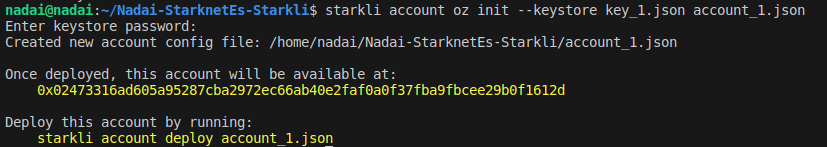

 starkli account deploy Nadai.json --keystore key_1.json

 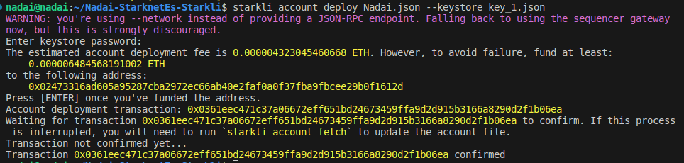

export STARKNET_ACCOUNT=/home/nadai/Nadai-StarknetEs-Starkli/Nadai.json
export STARKNET_KEYSTORE=/home/nadai/Nadai-StarknetEs-Starkli/key_1.json

Deberás crear un .json con scarb, starknet-compile....

starkli class-hash Hola.json

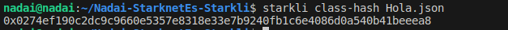

starkli declare --watch Hola.json

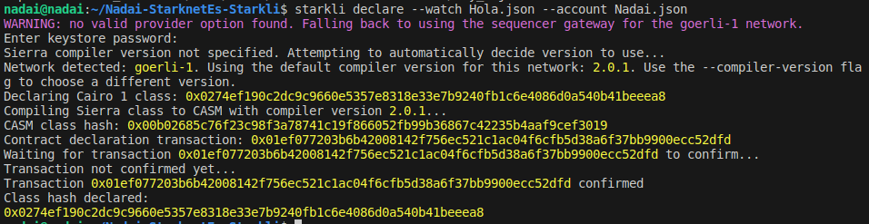

starkli deploy --watch 0x0274ef190c2dc9c9660e5357e8318e33e7b9240fb1c6e4086d0a540b41beeea8

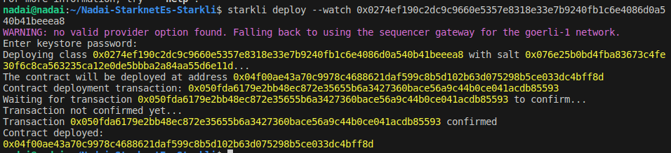

starkli invoke --watch 0x04f00ae43a70c9978c4688621daf599c8b5d102b63d075298b5ce033dc4bff8d Hola_Starknianos_Dice 1921882746024867290215520585294889529299439584169484315753

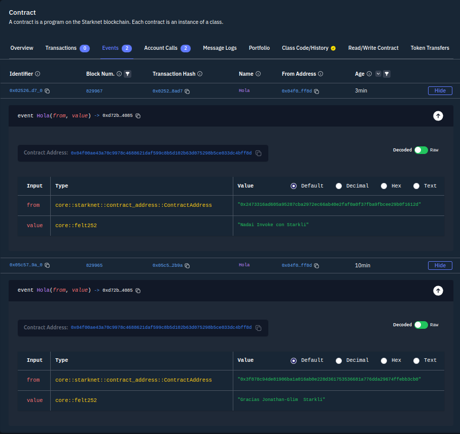

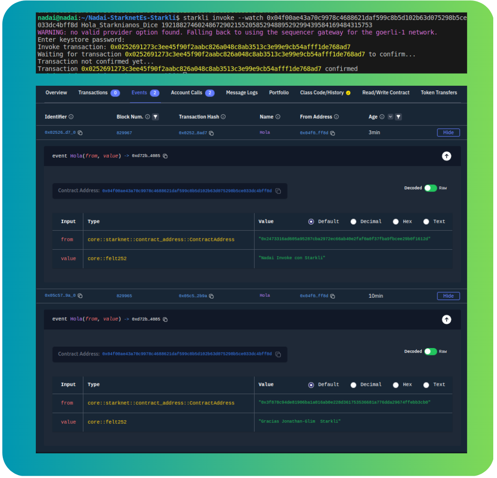

starkli selector Hola_Starknianos_Dice

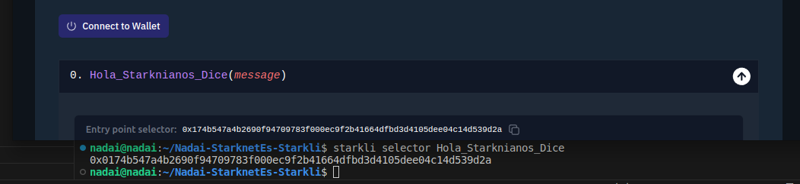

starkli call 0x018561e9475a9248f0580e3274fb8a027b33850dbd2e53f2d6acb9c14fcd0599 tokenURI \view_with_args\1

starkli transaction 0x0252691273c3ee45f90f2aabc826a048c8ab3513c3e99e9cb54afff1de768ad7

### comando favorito

starkli class-hash-at 0x04f00ae43a70c9978c4688621daf599c8b5d102b63d075298b5ce033dc4bff8d

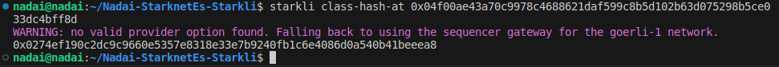

## STARKLI V2 OWNER

starkli class-hash Nadai_Ownable.sierra.json

0x04a0b25575b98b0dd16c1ffe5f85b6b310225437d5c151168c4ba010b498b3a0

starkli declare --watch Nadai_Ownable.sierra.json

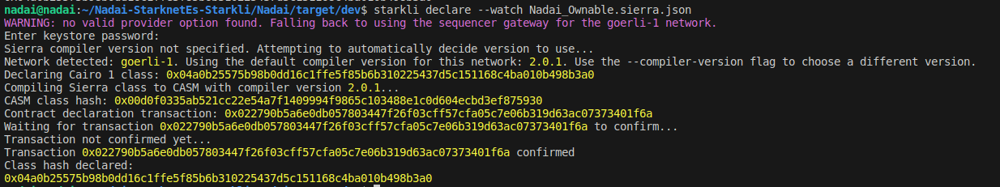

starkli deploy --watch 0x04a0b25575b98b0dd16c1ffe5f85b6b310225437d5c151168c4ba010b498b3a0 0x02473316ad605a95287cba2972ec66ab40e2faf0a0f37fba9fbcee29b0f1612d

starkli call 0x03b6e03f0cb4c6d69de89b3e600893bbb0b143ea689e9fed648f53ea26d68010 get_owner

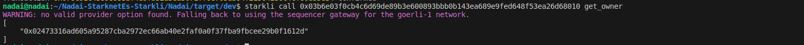

starkli invoke --watch 0x03b6e03f0cb4c6d69de89b3e600893bbb0b143ea689e9fed648f53ea26d68010 transfer_ownership 0x03F878C94De81906ba1A016aB0E228D361753536681a776ddA29674FfeBB3CB0

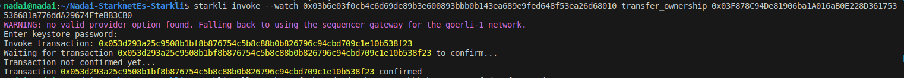

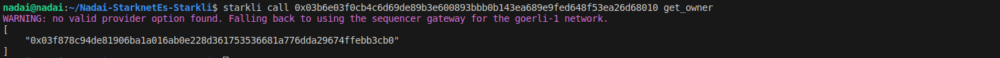

https://goerli.voyager.online/contract/0x03b6e03f0cb4c6d69de89b3e600893bbb0b143ea689e9fed648f53ea26d68010#readContract

starkli invoke --watch 0x049d36570d4e46f48e99674bd3fcc84644ddd6b96f7c741b1562b82f9e004dc7 approve 0x03F878C94De81906ba1A016aB0E228D361753536681a776ddA29674FfeBB3CB0 10000 0

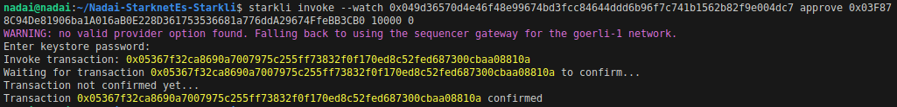

starkli invoke --watch 0x049d36570d4e46f48e99674bd3fcc84644ddd6b96f7c741b1562b82f9e004dc7 transfer 0x03F878C94De81906ba1A016aB0E228D361753536681a776ddA29674FfeBB3CB0 100000000000000 0

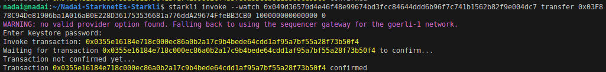

starkli call 0x049d36570d4e46f48e99674bd3fcc84644ddd6b96f7c741b1562b82f9e004dc7 balanceOf 0x2473316ad605a95287cba2972ec66ab40e2faf0a0f37fba9fbcee29b0f1612d 

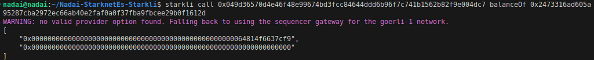

0x00000000000000000000000000000000000000000000000000064814f6637cf9 = 1768104730524921 0 = 0.001768 ETH

starkli parse-cairo-string 0x00000000000000000000000000000000000000000000000000737461726b6c69

starkli selector getPublicKey

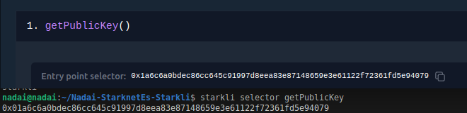