## Guía Workshop StarknetEs  
Starkliup es el instalador del entorno Starkli, y se puede instalar fácilmente utilizando la línea de comando con curl:

```bash
curl https://get.starkli.sh | sh
```

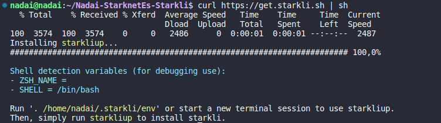

Reinicie la terminal después de ejecutar el comando. Una vez que Starkliup se ha instalado correctamente, se puede usar para instalar Starkli

```bash
starkliup
```

Al ejecutar el comando, verá lo siguiente:

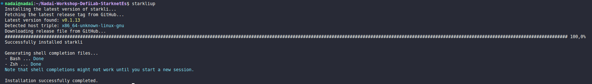


Reinicie el terminal y ejecute el siguiente comando para verificar la instalación:

```bash
starkli --version
```

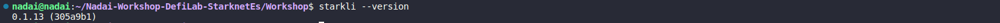

Para actualizar a la última versión de Starkli, simplemente siga los pasos anteriores nuevamente.

## Scarb

Para usuarios de macOS y Linux, abra su terminal y ejecute el siguiente comando:

```bash
curl --proto '=https' --tlsv1.2 -sSf https://docs.swmansion.com/scarb/install.sh | sh
```

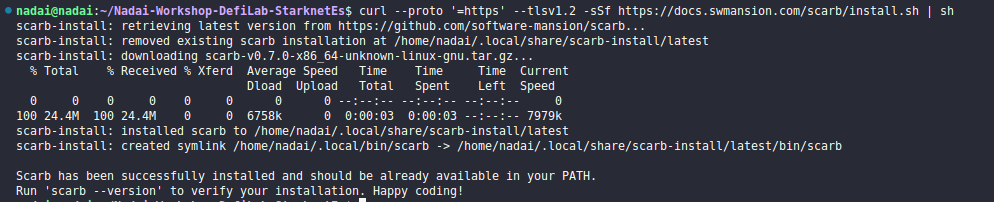

Reinicie el terminal y ejecute el siguiente comando para verificar la instalación:

```bash
scarb --version
```


Puede ejecutar el mismo comando para actualizarlo o directamnete añadir la versión manual de la versión que necesite de [aquí](https://github.com/software-mansion/scarb/releases)

```bash
curl --proto '=https' --tlsv1.2 -sSf https://docs.swmansion.com/scarb/install.sh | sh -s -- -v 0.6.0-alpha.4
```

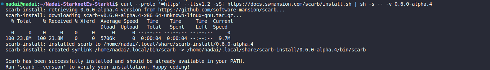

Ejecute el siguiente comando para verificar su nueva versión, está vez la `2.1.0-rc4`:

```bash
scarb --version
```

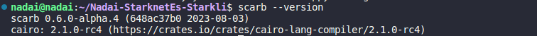

Puede revisar ahora que tanto Scarb como Starkli están instaladas y preparadas para probar esta gran combinación de herramientas para Starknet y Cairo:

```bash
scarb --version 
starkli  --version 
```

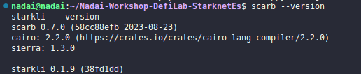

## Cuenta

Una billetera inteligente se compone de dos partes: un firmante y un descriptor de cuenta. El firmante es un contrato inteligente que puede firmar transacciones ( necesitamos su clave privada ). El descriptor de cuenta es un archivo json que contiene información sobre la billetera inteligente, como su dirección y clave pública.

Primero, cree una billetera inteligente a través de las extensiones del navegador Braavos o Argent X. Siga sus instrucciones de billetera ( Argent o Braavos ). Después de crear y financiar su billetera inteligente con ETH ( use el Grifo Starknet Goerli siempre que lo necesite ), puede implementarlo en el testnet de Starknet para este tutorial.

## Crear un firmante
Un firmante es un contrato inteligente que puede firmar transacciones. Es un componente crucial de las cuentas en Starknet. Para crear un Signer solo necesitamos la clave privada de nuestra billetera inteligente (, la clave pública se puede derivar de ella ).

Starkli nos brinda la capacidad de crear un archivo "keystore" que almacena de forma segura la clave privada de nuestras billeteras inteligentes, cada una con una contraseña. Las cuentas en el archivo de almacén de claves se pueden usar para firmar transacciones usando Starkli. La principal ventaja de este enfoque es que evita almacenar la clave privada como texto sin formato en nuestra computadora. En cambio, utilizamos una contraseña para crear un archivo cifrado en la ubicación que elijamos.

Normalmente, el archivo de almacén de claves se almacena en la ubicación predeterminada de la CLI de Starkli. El siguiente comando crea un archivo de almacén de claves para nuestra billetera inteligente en la ubicación predeterminada en

```bash
mkdir -p ~/.starkli-wallets
```

y luego 


```bash
mkdir ~/.starkli-wallets/deployer
```

Ahora podremos crear nuestro nueva cuenta y firmante o directamente exportar una pk y añadir una directamnte, en este caso hemos copiado la pk de una cuenta de braavos y vamos a usarla, le hemos dado el nombre de `Nadai_Signer.json` a esta cuenta, l acual vamos añadir la private key de la ceunta de ArgentX ode Braavos, en este caso usamos Braavos.

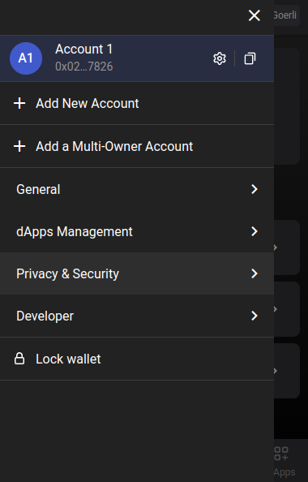 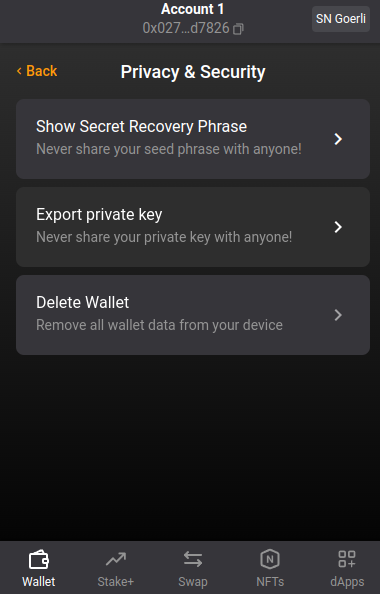

```bash
starkli signer keystore from-key ~/.starkli-wallets/deployer/Nadai_Signer.json
```

Aqui el  texto por seguiridad no se visualizaará asi que pegue u pf luego revise si desea añadir un contraseña o no, y añadala, si todo ha ido bien le deberá aperecer su clave pública debajo del archivo encriptado que cabamos de crear

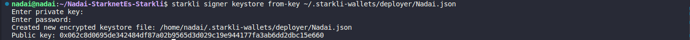


En el indicador de clave privada, pegue la clave privada de su billetera inteligente. En el mensaje de contraseña, ingrese una contraseña de su elección. Necesitará esta contraseña para firmar transacciones con Starkli.

Exporte la llave privada de su billetera Braavos o Argent. Para Argent X, puede encontrarlo en la sección "Configuración" → Seleccione su cuenta → "Exportar clave privada". Para Braavos, puede encontrarlo en la sección "Configuración" → "Privacidad y seguridad" → "Export Private Key".

Si bien es necesario conocer la clave privada de una billetera inteligente para firmar transacciones, no es suficiente. También debemos informar a Starkli sobre el mecanismo de firma empleado por nuestra billetera inteligente creada por Braavos o Argent X. ¿Usa una curva elíptica? En caso afirmativo, ¿cuál? Esta es la razón por la que necesitamos un archivo descriptor de cuenta.

## Crear un descriptor de cuenta
Starkli ofrece un comando para recopilar toda la información requerida de una billetera inteligente al proporcionar su dirección en cadena. Con estos datos, el CLI genera un archivo json que se puede usar para firmar transacciones.

```bash
touch ~/.starkli-wallets/deployer/Nadai_Account.json
```

El descripotr de la cuenta deberá de tener la siguiente estrucutra, que debermo s de ir rellenando:

```bash
{
  "version": 1,
  "variant": {
        "type": "open_zeppelin",
        "version": 1,
        "public_key": "<SMART_WALLET_PUBLIC_KEY>"
  },
    "deployment": {
        "status": "deployed",
        "class_hash": "<SMART_WALLET_CLASS_HASH>",
        "address": "<SMART_WALLET_ADDRESS>"
  }
}
```

La clave pública fue devuelta por el comando `starkli signer keystore from-key ~/.starkli-wallets/deployer/Nadai_Signer.json` Sin embargo, también puede encontrarlo usando el siguiente comando y escribiendo la contraseña que utilizó para crear el archivo keystore:

```bash
starkli signer keystore inspect ~/.starkli-wallets/deployer/Nadai_Signer.json
```

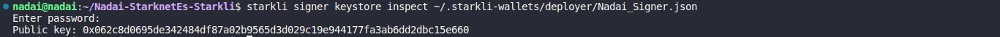

La dirección es la dirección de su billetera inteligente. Puede encontrarlo en las extensiones del navegador Braavos o Argent X. Luego use esta dirección para buscar el **class hash** de su billetera inteligente con el siguiente comando Starkli: 

```bash
starkli class-hash-at 0x027f68d0d0f474b1a25f359a42dc49a3003a3522d71765a5e7658e68520d7826
```

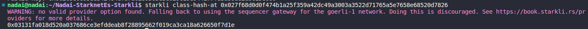

Aquí un ejemplo de como debería quedar con los datos completos:

```bash
{
  "version": 1,
  "variant": {
        "type": "open_zeppelin",
        "version": 1,
        "public_key": "0x062c8d0695de342484df87a02b9565d3d029c19e944177fa3ab6dd2dbc15e660"
  },
    "deployment": {
        "status": "deployed",
        "class_hash": "0x03131fa018d520a037686ce3efddeab8f28895662f019ca3ca18a626650f7d1e",
        "address": "0x027f68d0d0f474b1a25f359a42dc49a3003a3522d71765a5e7658e68520d7826"
  }
}
```

Quizás se pregunte por qué el tipo se define como `open_zeppelin` a pesar de que estamos trabajando con una billetera Braavos. Esto se debe a que la CLI utiliza el algoritmo predeterminado de Open Zeppelin para firmar transacciones, que es el mismo utilizado por Braavos y Argent X de forma predeterminada.

**Sin embargo, tenga en cuenta que una billetera inteligente Braavos con un firmante de hardware habilitado no funcionará en este contexto, ya que un firmante de hardware utiliza una curva elíptica diferente para firmar transacciones.**

## Configuración de variables de entorno
Para la mayoría de los indicadores de los diferentes comandos disponibles en Starkli, podemos definir variables de entorno para que los comandos sean más cortos y fáciles de administrar.

Hay dos variables de entorno primario que son vitales para el uso efectivo de la CLI de Starkli. Esta es la ubicación del archivo de la tienda de claves para el firmante y la ubicación del archivo del descriptor de cuenta.

```bash
export STARKNET_ACCOUNT=~/.starkli-wallets/deployer/Nadai_Account.json
export STARKNET_KEYSTORE=~/.starkli-wallets/deployer/Nadai_Signer.json
```

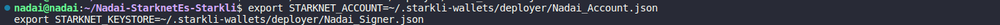

Con esto ya tendriamos lista nuestra Cuenta y Firmante para interactuar en Starknet a través de los comandos con Starkli,así que iremo sa preparar nuestro contrato para hacer el declare y el despliegue desde Scarb.

## Scarb 


## Comandos Starkli

starkli class-hash Hola.json

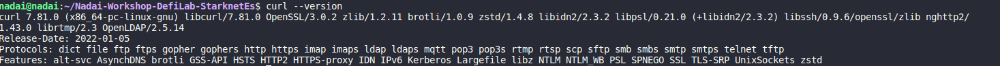

starkli declare --watch Hola.json

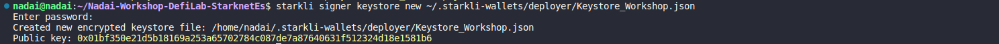

starkli deploy --watch 0x0274ef190c2dc9c9660e5357e8318e33e7b9240fb1c6e4086d0a540b41beeea8

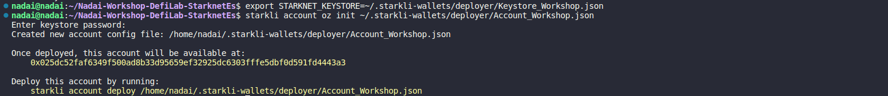

starkli invoke --watch 0x04f00ae43a70c9978c4688621daf599c8b5d102b63d075298b5ce033dc4bff8d Hola_Starknianos_Dice 1921882746024867290215520585294889529299439584169484315753

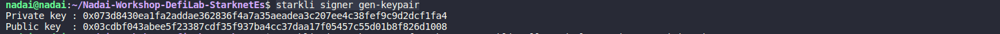

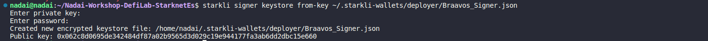

starkli selector Hola_Starknianos_Dice

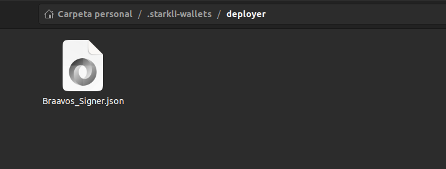

starkli call 0x018561e9475a9248f0580e3274fb8a027b33850dbd2e53f2d6acb9c14fcd0599 tokenURI \view_with_args\1

starkli transaction 0x0252691273c3ee45f90f2aabc826a048c8ab3513c3e99e9cb54afff1de768ad7

### comando favorito

starkli class-hash-at 0x04f00ae43a70c9978c4688621daf599c8b5d102b63d075298b5ce033dc4bff8d

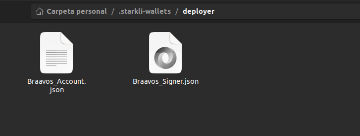


## STARKLI V2 OWNER

starkli class-hash Nadai_Ownable.sierra.json

0x04a0b25575b98b0dd16c1ffe5f85b6b310225437d5c151168c4ba010b498b3a0

starkli declare --watch Nadai_Ownable.sierra.json

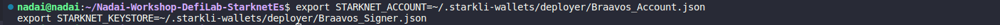

starkli deploy --watch 0x04a0b25575b98b0dd16c1ffe5f85b6b310225437d5c151168c4ba010b498b3a0 0x02473316ad605a95287cba2972ec66ab40e2faf0a0f37fba9fbcee29b0f1612d

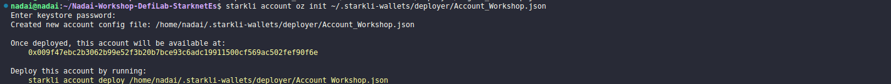

starkli call 0x03b6e03f0cb4c6d69de89b3e600893bbb0b143ea689e9fed648f53ea26d68010 get_owner

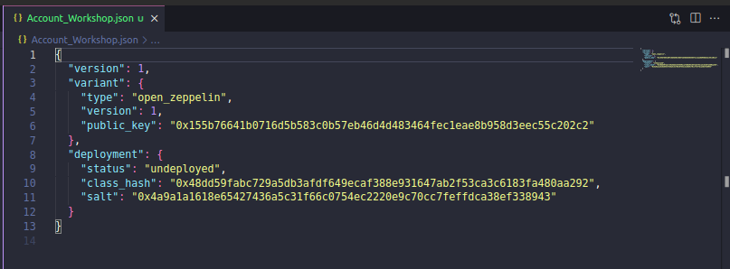

starkli invoke --watch 0x03b6e03f0cb4c6d69de89b3e600893bbb0b143ea689e9fed648f53ea26d68010 transfer_ownership 0x03F878C94De81906ba1A016aB0E228D361753536681a776ddA29674FfeBB3CB0

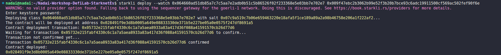

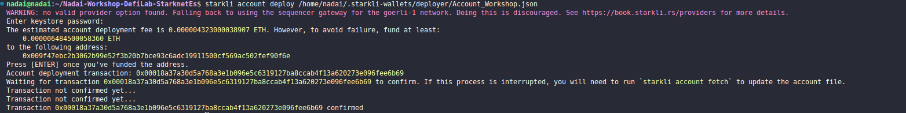


https://goerli.voyager.online/contract/0x03b6e03f0cb4c6d69de89b3e600893bbb0b143ea689e9fed648f53ea26d68010#readContract


starkli invoke --watch 0x049d36570d4e46f48e99674bd3fcc84644ddd6b96f7c741b1562b82f9e004dc7 approve 0x03F878C94De81906ba1A016aB0E228D361753536681a776ddA29674FfeBB3CB0 10000 0


starkli invoke --watch 0x049d36570d4e46f48e99674bd3fcc84644ddd6b96f7c741b1562b82f9e004dc7 transfer 0x03F878C94De81906ba1A016aB0E228D361753536681a776ddA29674FfeBB3CB0 100000000000000 0


starkli call 0x049d36570d4e46f48e99674bd3fcc84644ddd6b96f7c741b1562b82f9e004dc7 balanceOf 0x2473316ad605a95287cba2972ec66ab40e2faf0a0f37fba9fbcee29b0f1612d 


0x00000000000000000000000000000000000000000000000000064814f6637cf9 = 1768104730524921 0 = 0.001768 ETH

starkli parse-cairo-string 0x00000000000000000000000000000000000000000000000000737461726b6c69

starkli selector getPublicKey


starkli invoke --watch 0x07686ccbe3e33aefec722bd7211e42e47269f16a2a918318bdb27a99c926899b mint 1 0

starkli deploy --watch 0x026993fbbca1fc804df732e9aeaf421939c7c994c901e11b99256c6e48a7115f 0x62c8d0695de342484df87a02b9565d3d029c19e944177fa3ab6dd2dbc15e660

0x6837fcdea25fa6e8c9ca48eb357f793b751924ae48cdc353e2afab88e7338e2
0x2e4b8750057c4cff92b18b53cfb6c24b9f2202959a6dbb4b9afb2dcf054624c