<div align="center">

  <h1 style="font-size: larger;">
    
    <strong> Workshop Starknet-Defilab & EscuelaCryptoES </strong> 
    
  </h1>

<a href="https://github.com/Starknet-Es">

<a href="https://github.com/Starknet-Es/jueves-de-cairo">

</a>
</a>
<a href="https://twitter.com/StarkNetEs">

</a>
<a href="https://twitter.com/DeFi_LaB">

</a>
<a href="https://twitter.com/Nadai02010">

</a>
<a href="https://github.com/Starknet-Es/StarknetEs-Aprendizaje">

</a>

</div>

## Recursos oficiales

- [Starknet Doc](https://docs.starknet.io/documentation/) - Documentos oficiales de Starknet
- [Starknet Book](https://book.starknet.io/) - Libro de Starknet
- [Cairo Doc](https://www.cairo-lang.org/docs/) - Documentos oficiales de de Cairo
- [Libro Cairo](https://cairo-book.github.io/) - Libro de Cairo
- [Sintaxis Cairo by Nethermind](https://github.com/NethermindEth/CairoByExample/)  |   [Sintaxis Cairo by LambdaClass](https://github.com/lambdaclass/cairo-by-example/)

---

## Temas 

- [Pre-requisitos](#pre-requisitos)
 - [Git](#git)
 - [Curl](#curl)
- [Instalación de Starkli](#instalación-de-starkli)
- [Instalación de Scarb](#instalación-de-scarb)
- [Cuentas y Firmantes](#cuenta-y-firmantes)
    - [Crear Cuenta con Starkli (Opción A)](#crear-cuenta-con-starkli-opción-a)      
      - [Conseguir Faucet](#conseguir-faucet)
      - [Configuración de Variables de Entorno A](#configuración-de-variables-de-entorno-a)
      - [Desplegar Contrato de Cuenta A](#desplegar-contrato-de-cuenta-a)
    - [Crear Cuenta ArgentX o Braavos (Opción B)](#crear-cuenta-argentx-o-braavos-opción-b)
      - [Desplegar Contrato de Cuenta B](#desplegar-contrato-de-cuenta)
      - [Añadir Cuenta y nuevo Firmante](#añadir-cuenta-y-nuevo-firmante)
      - [Crear Descriptores de Cuentas](#crear-descriptores-de-cuentas)
      - [Configuración de Variables de Entorno B](#configuración-de-variables-de-entorno-b)
    - [Crear Cuenta con Starkli Gen Pair-Key (Opción C)](#crear-cuenta-con-starkli-gen-pair-opción-c)
- [Integrando Scarb en tu Flujo de Desarrollo](#integrando-scarb-en-tu-flujo-de-desarrollo)
    - [Inicialización del Proyecto](#inicialización-del-proyecto)
    - [Desarrollo del Contrato](#desarrollo-del-contrato)
    - [Gestión de Dependencias](#gestión-de-dependencias)
    - [Extensión Cairo VS Code](#extensión-cairo-vs-code)
    - [Compilación del Contrato](#compilación-del-contrato)
- [Declare del Contrato con Starkli](#declare-del-contrato-con-starkli)
- [Despliegue del Contrato con Starkli](#despligue-del-contrato-con-starkli)
- [Invocando Contratos con Starkli](#invocando-contratos-con-starkli)
- [Comandos Starkli](#comandos-starkli)
- [Gestión de Dependencias Externas en Scarb](#gestión-de-dependencias-externas-en-scarb)
- [dApp STARK Easy](#dapp-stark-easy)
  - [Pasos para Desplegar tu Contrato con STARK Easy](#pasos-para-desplegar-tu-contrato-con-stark-easy)


---

## Pre-requisitos
Antes de continuar, asegúrese de tener instalados los siguientes pre-requisitos en su sistema:

### Git
[Git:](https://git-scm.com/) Será necesario tener `Git` instalado. A continuación, se muestra el comando para instalar `Git` en Ubuntu. Recuerda verificar las versiones disponibles para tu sistema operativo en el enlace proporcionado:

```bash
apt-get install git
```

Si se produce un error y te solicita entrar como administrador, agrega `sudo` al principio del comando. Se abrirá una ventana para ingresar tu contraseña (que será invisible) y luego puedes presionar Enter para continuar.

```bash
sudo apt-get install git
```

### Curl
El procedimiento para instalar `cURL` en Ubuntu Linux es el siguiente:

- Actualiza tu sistema Ubuntu ejecutando: 

```bash
sudo apt update && sudo apt upgrade
```

- A continuación, instala cURL ejecutando: 

```bash
sudo apt install curl
```

- Verifica la instalación de cURL en Ubuntu ejecutando:

```bash
curl --version
```

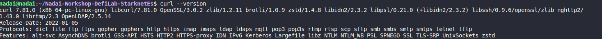

---
## Instalación de Starkli
[Starkli](https://book.starkli.rs/introduction) es una interfaz de línea de comandos que te permite interactuar con Starknet. Esta es una de las herramientas que nos permite interactuar con Starknet, sin embargo, no es la única. 
Starkliup es el instalador del entorno Starkli, y se puede instalar fácilmente utilizando la línea de comando con curl:

```bash
curl https://get.starkli.sh | sh
```


Puede que necesites reiniciar tu sesión de shell para que el comando starkliup esté disponible. Una vez que esté disponible, ejecuta el comando starkliup:

```bash
starkliup
```

Starkliup detecta la plataforma de tu dispositivo y descarga automáticamente el binario precompilado adecuado. También configura las autocompletaciones de la shell. Es posible que necesites reiniciar tu sesión de shell para que las autocompletaciones comiencen a funcionar.

Ejecutar estos comandos instalará starkli para ti y lo actualizará a la última versión si ya está instalado.


Reinicie el terminal y ejecute el siguiente comando para verificar la instalación:

```bash
starkli --version
```


**Para actualizar a la última versión de Starkli, simplemente siga los pasos anteriores nuevamente.**

## Instalación de Scarb
[Scarb](https://docs.swmansion.com/scarb/) es el administrador de paquetes para Cairo. Entre otras cosas, nos permite compilar código Cairo a Sierra, el lenguaje intermedio entre el Cairo de alto nivel y el ensamblador Cairo de bajo nivel (CASM). Para usuarios de macOS y Linux, abra su terminal y ejecute el siguiente comando:

```bash
curl --proto '=https' --tlsv1.2 -sSf https://docs.swmansion.com/scarb/install.sh | sh
```


Reinicie el terminal y ejecute el siguiente comando para verificar la instalación:

```bash
scarb --version
```


Puede ejecutar el mismo comando para actualizarlo o directamnete añadir la versión manual de la versión que necesite de [aquí](https://github.com/software-mansion/scarb/releases)

```bash
curl --proto '=https' --tlsv1.2 -sSf https://docs.swmansion.com/scarb/install.sh | sh -s -- -v 0.6.0-alpha.4
```


Ejecute el siguiente comando para verificar su nueva versión, está vez la `2.1.0-rc4`:

```bash
scarb --version
```


Aunque esta información se proporciona en caso de que desee instalar una versión específica, se recomienda instalar la versión estable utilizando el primer comando o siempre revisar las compatibilidades de las versiones del compilador [aquí](https://github.com/software-mansion/scarb/releases).

Puede verificar ahora que tanto `Scarb` como `Starkli` están instalados y listos para probar esta poderosa combinación de herramientas para Starknet y Cairo. Para esta guía, hemos configurado estas versiones como las más estables y actualizadas:

```bash
scarb --version 
starkli  --version 
```


## Cuenta y Firmantes
Una billetera inteligente se compone de dos partes: un `firmante` y un `descriptor de cuenta`.

- El `firmante` es un contrato inteligente que tiene la capacidad de firmar transacciones, y para ello, necesitamos su clave privada.
- El `descriptor de cuenta` es un archivo en formato `json` que contiene información relevante sobre la billetera inteligente, como su dirección y clave pública.

Tenemos tres opciones para crear nuestra cuenta:

- **Opción A:** Configuraremos nuestro entorno de desarrollo utilizando las lógicas de OZ (OpenZeppelin) y Starknet para crear un nuevo Contrato de Cuenta.
- **Opción B:** Crearemos la cuenta a través de Argent o Braavos, exportando nuestra clave privada.
- **Opción C:** Aprenderemos el proceso desde cero, generando el par de claves privada y pública off-chain sobre la curva Stark-Friendly. 

Sin embargo, antes de avanzar, es necesario configurar el `firmante`.

---

## Crear Firmante con Starkli
Starkli utiliza firmantes o `signers` para firmar transacciones. Un signer puede ser cualquier entidad que pueda proporcionar firmas válidas para las transacciones, como un contrato inteligente con la capacidad de firmar transacciones, siendo un componente esencial en las cuentas de Starknet. 

Para crear un signer, solo necesitamos la clave privada de nuestra billetera inteligente (la clave pública se puede derivar de esta). En la práctica, los siguientes tipos de signers son actualmente compatibles:

1. Almacenes de claves cifradas.
2. Claves privadas en texto sin formato.

Starkli nos brinda la capacidad de generar un archivo `keystore` que almacena de forma segura la clave privada de nuestras billeteras inteligentes, cada una protegida por una contraseña única. Estas cuentas en el archivo de almacén de claves se pueden utilizar para firmar transacciones a través de Starkli. 

Una ventaja fundamental de este enfoque es que evita la necesidad de almacenar la clave privada en texto sin formato en nuestra computadora. En su lugar, utilizamos una contraseña para crear un archivo cifrado en la ubicación que elijamos.

Por lo general, el archivo de almacén de claves se guarda en la ubicación predeterminada de la CLI de Starkli. El siguiente comando crea un archivo de almacén de claves para nuestra billetera inteligente en la ubicación predeterminada:

```bash
mkdir -p ~/.starkli-wallets/deployer
```

---

### Crear Cuenta con Starkli (Opción A)
Podemos crear nuestro contrato de cuenta utilizando los comandos de la CLI de Starknet. La herramienta Starkli facilita la gestión de estos comandos y ajustes de manera más sencilla. Los Contratos de Cuentas creados desde Starknet siguen un estándar establecido por el equipo de desarrollo principal y OpenZeppelin, que también podemos utilizar, además, tenemos la opción de añadir contratos creados por Braavos o ArgentX, consiguiendo que cada desarrollador tenga la libertad de elegir o crear su propia lógica para los contratos de cuenta, lo que ofrece diversidad a los usuarios.

Para crear una keystore de claves desde cero, podemos utilizar la ubicación que asignamos anteriormente: `~/.starkli-wallets/deployer`. En este caso, le daremos el nombre de `Signer_Workshop.json`. El sistema le pedirá una contraseña, que también puede dejar en blanco y tenga en cuenta que `no se mostrará el texto que escriba` por razones de seguridad.

```bash
starkli signer keystore new ~/.starkli-wallets/deployer/Signer_Workshop.json
```

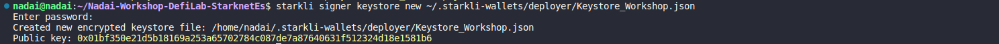

Esto nos dará un nuevo archivo cifrado llamado `Signer_Workshop.json`, ahora puede establecer una variable de entorno `STARKNET_KEYSTORE` para facilitar las invocaciones de comandos:

```bash
export STARKNET_KEYSTORE=~/.starkli-wallets/deployer/Signer_Workshop.json
```

Ahora crearemos la cuenta que estará controlada y cifrada por el `signer` que hemos creado. Además, veremos cómo se pueden añadir diversos signers más adelante, pero por ahora nos centraremos en crear nuestra `Account` en el archivo `Account_Workshop.json`.

```bash
starkli account oz init ~/.starkli-wallets/deployer/Account_Workshop.json
```

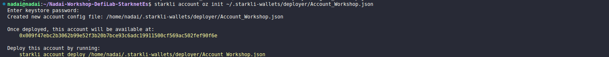

Si navegamos a la ubicación donde estamos creando el `Keystore` y la `Account` (recuerde que normalmente está oculta; revise su configuración, pero en Ubuntu y Linux suele ser `ctrl + h`), podrá revisar la estructura del archivo que se ha creado. El estado es `undeployed`, ya que solo hemos calculado y generado el Contrato de Cuenta. También veremos cómo coincide la clave pública y tenemos un `descriptor` creado completo, pero aún falta enviar saldo a esta dirección, que en este caso es `0x009f47ebc2b3062b99e52f3b20b7bce93c6adc19911500cf569ac502fef90f6e`, para que pueda desplegarse.

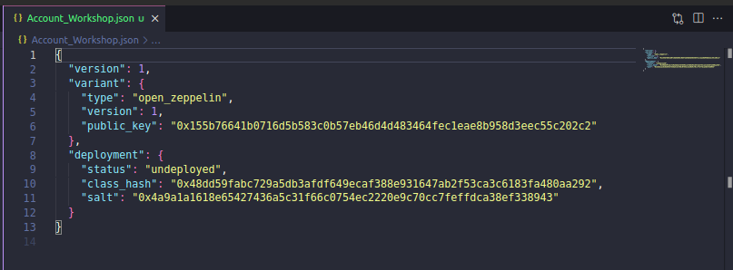

---

### Conseguir Faucet
Aquí hay varios enlaces y métodos que le proporcionaremos para que pueda desplegar su contrato de cuenta. En este caso, utilizaremos la red de prueba de Goerli en Starknet, donde podrá recibir fondos ETH de varias maneras:

1. **Desde un Faucet de Starknet:** Puede obtener fondos ETH de forma gratuita en la red Goerli de Starknet utilizando el [Faucet Starknet](https://faucet.goerli.starknet.io/).

2. **A través de Starkgate Bridge L1-L2:** También puede transferir fondos desde la capa 1 (L1) de Ethereum en Goerli a la capa 2 (L2) de Starknet utilizando el [Starkgate Bridge L1-L2](https://goerli.starkgate.starknet.io/).

3. **Depositando ETH desde otra dirección:** Tienes la opción de depositar ETH en su contrato de cuenta desde otra dirección de prueba de Starknet o cualquier otra billetera compatible con la red de prueba.


---

### Configuración de Variables de Entorno A
Una vez haya enviado los fondos o solicitado desde el Faucet, procederemos al despliegue. Primero, asegurémonos de haber exportado tanto el `KEYSTORE` como la variable `ACCOUNT`, y luego ejecutaremos el siguiente comando, apuntando a la ubicación y archivo de la cuenta:

```bash
export STARKNET_KEYSTORE=~/.starkli-wallets/deployer/Signer_Workshop.json
export STARKNET_ACCOUNT=~/.starkli-wallets/deployer/Account_Workshop.json
```

---

### Desplegar Contrato de Cuenta
A continuación, procederemos al despliegue. El sistema nos pedirá la contraseña del firmante y nos dará una advertencia si hemos enviado fondos a esa dirección.

```bash
starkli account deploy /home/nadai/.starkli-wallets/deployer/Account_Workshop.json
```

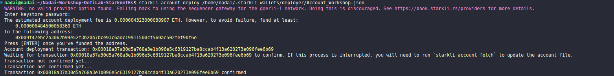

Con estos pasos, nuestra cuenta estará desplegada, financiada y lista para interactuar en Starknet mediante los comandos de Starkli. Podemos verificar en nuestro archivo que el estado ha cambiado a `deployed` y ahora se nos proporciona la `address`. Con todo preparado, podemos avanzar para preparar nuestro contrato, compilarlo desde Scarb y declararlo y desplegarlo con Starkli. Pero antes de eso, proporcionaremos una breve descripción de las Opción B y Opción C.

---

### Crear Cuenta en ArgentX o Braavos (Opción B)
En primer lugar, cree una billetera inteligente siguiendo las instrucciones proporcionadas por las extensiones del navegador [Braavos](https://braavos.app/download-braavos-wallet/) o [Argent X](https://www.argent.xyz/argent-x/).

Después de crear su billetera, necesitará financiarla con ETH de prueba, que puede obtener a través de un Faucet, utilizando el Bridge de StarkGate o transfiriéndolos desde otra cuenta (este podriá ser un caso tanto en la red de pruebas como en la principal). Revise la sección [Faucet](#conseguir-faucet) para encontrar enlaces útiles, pero en este tutorial, usaremos la testnet de Goerli en Starknet para implementarlo.

### Desplegar Contrato de Cuenta (Opción B)
La forma más sencilla de hacerlo es dentro de cada billetera una vez que haya recibido los fondos. Simplemente seleccione la opción de desplegar nuestro Contrato de Cuenta, y luego podremos agregarlo en Starkli para interactuar con Starknet y nuestros Contratos de Cairo.

### Añadir Cuenta y nuevo Firmante
Ahora podremos crear un nuevo signer y exportar directamente nuestra clave privada para agregarla.

- Para Argent X: Puede encontrarla en la sección "Configuración" → Seleccione su cuenta → "Exportar clave privada".
- Para Braavos: Puede encontrarla en la sección "Configuración" → "Privacidad y seguridad" → "Exportar clave privada".

En este caso, hemos copiado la `Clave Privada` de una cuenta de Braavos y la utilizaremos. Nombraremos a este signer como `Braavos_Signer.json` cuando creeemos el `Keystore`. En este archivo, nos pedirá agregar una clave privada, en la que añadiremos de la cuenta de ArgentX o Braavos que haya elegido. Como se muestra a continuación, en este caso utilizaremos Braavos.

 

```bash
starkli signer keystore from-key ~/.starkli-wallets/deployer/Braavos_Signer.json
```

En la imagen vemos como se le solicitará el texto para agregar el indicador de clave privada, por motivos de seguridad **no se mostrará en pantalla**, así que pegue su `clave privada` y luego decida si desea agregar una contraseña o no. Deberá recordar esta contraseña para firmar transacciones con Starkli. Si todo se ha realizado correctamente, verá su clave pública que deberá coincidir con la de su cuenta utilizada.

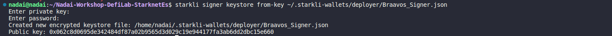

Con esta parte, habremos configurado nuestro firmante, y a continuación, definiremos cómo utilizaremos nuestro Contrato de Cuenta creando un `Descriptor de Cuenta` con la información necesaria.

---

## Crear Descriptores de Cuentas
Starkli ofrece un comando para recopilar toda la información necesaria de su cuenta directamente desde una billetera inteligente al proporcionar su dirección en la cadena. Con estos datos, el CLI genera un archivo JSON que se puede usar para firmar transacciones. Para iniciar, crearemos un archivo vacío en el que agregaremos el "Descriptor":

```bash
touch ~/.starkli-wallets/deployer/Braavos_Account.json
```

Sin embargo, si su Contrato de Cuenta ya ha sido desplegado, Starkli le ofrece la comodidad de tener el descriptor de la `Account`. Esto es fundamental para la recuperación de la cuenta, ya que permite recrear el archivo de cuenta únicamente a partir de datos en la cadena. Esto puede ser útil en los siguientes casos:

- Cuando se ha perdido el archivo de cuenta.
- Al migrar una cuenta desde otra herramienta o aplicación.

El comando `starkli account fetch` crea un archivo de cuenta utilizando solo la dirección proporcionada:

```bash
starkli account fetch <DIRECCIÓN> --output /ruta/hacia/cuenta
```

En nuestro caso, al ejecutar el comando anterior con los datos de nuestra cuenta de Braavos, nos creará el archivo de cuenta en `~/.starkli-wallets/deployer/Braavos_Account.json`:

```bash
starkli account fetch 0x027f68d0d0f474b1a25f359a42dc49a3003a3522d71765a5e7658e68520d7826 --output ~/.starkli-wallets/deployer/Braavos_Account.json
```

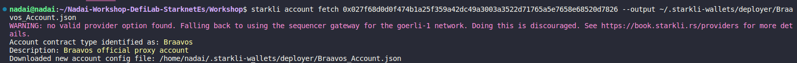

Recuerde que para encontrar este archivo, deberá ir a la ruta oculta que mencionamos anteriormente: `~/.starkli-wallets/deployer`. Estos archivos suelen estar ocultos, así que revise su configuración. En Ubuntu y Linux, puede mostrar archivos ocultos con la combinación de teclas `ctrl + h`.

Si bien es necesario conocer la clave privada de una billetera inteligente para firmar transacciones, eso no es suficiente. También debemos informar a Starkli sobre el mecanismo de firma empleado por nuestra billetera inteligente creada por Braavos o Argent X. ¿Utiliza una curva elíptica? En caso afirmativo, ¿cuál? Esta es la razón por la que necesitamos un archivo descriptor de cuenta.

El descriptor de la cuenta debe tener la siguiente estructura, aunque puede variar según las versiones y configuraciones. Deberemos completar estos datos si no coinciden con los de sus cuentas o si desea agregar los datos manualmente desde cualquier editor de código si es necesario:

```bash
{
  "version": 1,
  "variant": {
        "type": "open_zeppelin",
        "version": 1,
        "public_key": "<CLAVE_PÚBLICA_BILLETERA_INTELIGENTE>"
  },
    "deployment": {
        "status": "deployed",
        "class_hash": "<HASH_CLASE_BILLETERA_INTELIGENTE>",
        "address": "<DIRECCIÓN_BILLETERA_INTELIGENTE>"
  }
}
```

La clave pública se obtuvo mediante el comando `starkli signer keystore from-key ~/.starkli-wallets/deployer/Braavos_Signer.json`. Sin embargo, también puede encontrarla usando el siguiente comando y escribiendo la contraseña que utilizó para crear el archivo de almacén de claves (keystore):

```bash
starkli signer keystore inspect ~/.starkli-wallets/deployer/Braavos_Signer.json
```


La dirección es la dirección de su billetera inteligente, que puede encontrar en las extensiones del navegador Braavos o Argent X. Luego, use esta dirección para buscar el **hash de clase (class hash)** de su billetera inteligente. Además, necesitará el **hash de la implementación (implementation hash)**, que se encuentra en el explorador al agregar su dirección y ver la sección `Overview`(Resumen), donde encontrará la `Deployed At Transaction Hash` (Hash de transacción de implementación). Aunque puede obtener el **class hash** con el siguiente comando Starkli:

```bash
starkli class-hash-at 0x027f68d0d0f474b1a25f359a42dc49a3003a3522d71765a5e7658e68520d7826
```


Aquí hay un ejemplo de cómo debería verse el descriptor con los datos completos:

```bash
{
  "version": 1,
  "variant": {
        "type": "open_zeppelin",
        "version": 1,
        "public_key": "0x062c8d0695de342484df87a02b9565d3d029c19e944177fa3ab6dd2dbc15e660"
  },
    "deployment": {
        "status": "deployed",
        "class_hash": "0x03131fa018d520a037686ce3efddeab8f28895662f019ca3ca18a626650f7d1e",
        "address": "0x027f68d0d0f474b1a25f359a42dc49a3003a3522d71765a5e7658e68520d7826"
  }
}
```

Es posible que se pregunte por qué el tipo se define como `open_zeppelin` a pesar de que estamos trabajando con una billetera Braavos. Esto se debe a que la CLI utiliza el algoritmo predeterminado de Open Zeppelin para firmar transacciones, que es el mismo utilizado por Braavos y Argent X de forma predeterminada. Los Contratos de Cuenta de Cairo 1 tienen un descriptor más optimizado.

Si ha utilizado el comando `starkli account fetch <DIRECCIÓN> --output /ruta/hacia/cuenta` para crear el descriptor, este podría tener un aspecto más específico con su identificación:

```bash
{
  "version": 1,
  "variant": {
    "type": "braavos",
    "version": 1,
    "implementation": "0x105c0cf7aadb6605c9538199797920884694b5ce84fc68f92c832b0c9f57ad9",
    "multisig": {
      "status": "off"
    },
    "signers": [
      {
        "type": "stark",
        "public_key": "0x62c8d0695de342484df87a02b9565d3d029c19e944177fa3ab6dd2dbc15e660"
      }
    ]
  },
  "deployment": {
    "status": "deployed",
    "class_hash": "0x3131fa018d520a037686ce3efddeab8f28895662f019ca3ca18a626650f7d1e",
    "address": "0x27f68d0d0f474b1a25f359a42dc49a3003a3522d71765a5e7658e68520d7826"
  }
}
```

**Tenga en cuenta que algunos detalles pueden variar según las circunstancias y las versiones. Recuerde que una billetera inteligente Braavos con un firmante de hardware habilitado no funcionará en este contexto, ya que un firmante de hardware utiliza una curva elíptica diferente para firmar transacciones.**

---

## Configuración de Variables de Entorno B
Para simplificar y agilizar el uso de los comandos disponibles en Starkli, podemos definir variables de entorno que faciliten la gestión de las rutas de archivos necesarios. Dos de las variables de entorno más importantes para aprovechar al máximo la CLI de Starkli son la ubicación del archivo de almacenamiento de claves del firmante y la ubicación del archivo de descriptor de cuenta.

```bash
export STARKNET_ACCOUNT=~/.starkli-wallets/deployer/Braavos_Account.json
export STARKNET_KEYSTORE=~/.starkli-wallets/deployer/Braavos_Signer.json
```

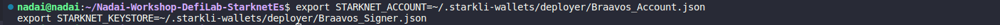

Con estas variables de entorno configuradas, ya tendremos listos nuestra Cuenta y Firmante para interactuar con Starknet a través de los comandos de Starkli. A continuación, procederemos a preparar nuestro contrato para compilarlo con Scarb y luego declararlo y desplegarlo con Starkli. Pero antes, exploraremos la Opción C.

## Crear Cuenta con Starkli Gen-Pair (Opción C)
Otra opción que podemos utilizar es generar un par de claves, una privada y una pública, utilizando la herramienta Starkli Gen-Pair. Sin embargo, es importante destacar que este método se recomienda principalmente con fines ilustrativos, ya que las opciones anteriores son las más aconsejables desde una perspectiva de seguridad. 

Para generar nuestro par de claves, ejecutamos el siguiente comando:

```bash
starkli signer gen-keypair
```

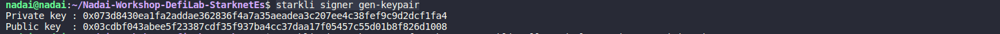

Es importante recordar que nunca debemos compartir estas claves privadas, ya que esta cuenta se ha creado desde cero, como ha visto en este taller. Ahora, configuraremos nuestro `Signer` siguiendo los mismos pasos que en la Opción B, desde `starkli signer keystore from-key ~/.starkli-wallets/deployer/Braavos_Signer.json`. Sin embargo, esta vez, debemos darle un nombre diferente al archivo, ya que estamos utilizando un par de claves generado de forma diferente. Desde aquí, podrá agregar la "clave privada" generada anteriormente y seguir los mismos pasos que en los procesos anteriores.

Una vez que hayamos configurado todo, incluyendo nuestras variables de entorno, procederemos a crear nuestro contrato `Owner.cairo` utilizando Scarb.

---

## Integrando Scarb en tu Flujo de Desarrollo 
Los siguientes pasos ilustran un flujo de trabajo típico para desarrollar un contrato Starknet utilizando Scarb, aunque si ha cloando este repositorio y quiere sólo seguir los procesos, pase directamente al paso 4.

1. Inicialización del Proyecto: Comienza ejecutando `scarb new` para crear un nuevo proyecto. Este comando generará automáticamente la estructura básica del proyecto, incluyendo un archivo de configuración `Scarb.toml` y un archivo inicial `src/lib.cairo`.

2. Desarrollo del Contrato: Escribe tu código Cairo y guárdalo en el directorio src, en este caso usaremos como base un contrato de Propiedad `Owner.cairo`

3. Gestión de Dependencias: Si tu contrato depende de bibliotecas externas, utiliza `scarb add` para incluir fácilmente estas dependencias en tu proyecto.

4. Compilación del Contrato: Ejecuta `scarb build` para compilar tu contrato en código Sierra. Este código resultante puede luego ser examinado con más detalle o utilizado como entrada para otras herramientas o procesos.

Al integrar Scarb en tu flujo de trabajo, aprovechas sus características para hacer tu proceso de desarrollo más eficiente y manejable.

### Inicialización del Proyecto:
Para empezar, crearemos un nuevo paquete que generará los archivos `Scarb.toml` y `src/lib.cairo` utilizando el siguiente comando, seguido del nombre del proyecto (en nuestro caso, `Workshop`):

```bash
scarb new Workshop
```

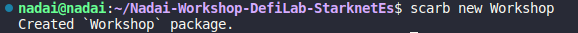

En esta etapa, es importante destacar que, para una gestión más efectiva de los contratos, se recomienda mantener el archivo [`lib.cairo`](/Workshop/src/lib.cairo) para añadir módulos y crear los contratos de manera independiente. Por ejemplo, puedes crear el contrato [`Owner.cairo`](/Workshop/src/Owner.cairo) u otros contratos por separado. Aunque también es posible utilizar el archivo [`lib.cairo`](/Workshop/src/lib.cairo) e incluir el código del contrato que deseas ejecutar, se sugiere seguir la siguiente metodología para una mejor organización.

### Desarrollo del Contrato:
Comenzamos creando un archivo en la carpeta `src` con el nombre del contrato que deseamos crear, en este caso [`Owner.cairo`](/Workshop/src/Owner.cairo), y pegamos el siguiente código:

```rust
use starknet::ContractAddress;

#[starknet::interface]
trait OwnableTrait<T> {
    fn transfer_ownership(ref self: T, new_owner: ContractAddress);
    fn get_owner(self: @T) -> ContractAddress;
}

#[starknet::contract]
mod Ownable {
    use super::ContractAddress;
    use starknet::get_caller_address;

    #[event]
    #[derive(Drop, starknet::Event)]
    enum Event {
        OwnershipTransferred1: OwnershipTransferred1,  
    }

    #[derive(Drop, starknet::Event)]
    struct OwnershipTransferred1 {
        #[key]
        prev_owner: ContractAddress,
        #[key]
        new_owner: ContractAddress,
    }

    #[storage]
    struct Storage {
        owner: ContractAddress,
    }

    #[constructor]
    fn constructor(ref self: ContractState, init_owner: ContractAddress) {
        self.owner.write(init_owner);
    }

    #[external(v0)]
    impl OwnableImpl of super::OwnableTrait<ContractState> {
        fn transfer_ownership(ref self: ContractState, new_owner: ContractAddress) {
            self.only_owner();
            let prev_owner = self.owner.read();
            self.owner.write(new_owner);
            self.emit(Event::OwnershipTransferred1(OwnershipTransferred1 {
                prev_owner: prev_owner,
                new_owner: new_owner,
            }));
        }

        fn get_owner(self: @ContractState) -> ContractAddress {
            self.owner.read()
        }
    }

    #[generate_trait]
    impl PrivateMethods of PrivateMethodsTrait {
        fn only_owner(self: @ContractState) {
            let caller = get_caller_address();
            assert(caller == self.owner.read(), 'Caller is not the owner');
        }
    }
}
```

A continuación, vamos a nuestro archivo [`lib.cairo`](/Workshop/src/lib.cairo), eliminamos el ejemplo de Fibonacci que viene por defecto y añadimos la indicación de los contratos en módulos que vamos a utilizar.

```rust
mod Owner;
```

---

### Gestión de Dependencias
Una vez hayas copiado los pasos anteriores de este taller, deberás guardar todos los cambios en tu editor de código y proceder a modificar tu archivo `Scarb.toml`. En la sección `[dependencies]`, podrás añadir dependencias externas como por ejemplo las de OpenZeppelin u otras que necesites. Además, asegúrate de que en la sección `[[target.starknet-contract]]` de tu archivo `Scarb.toml` especifiques `sierra = true` para que la compilación genere el código en la representación intermedia de Sierra en formato `.json`.

Es importante señalar que si no indicas `sierra = true` en la sección correspondiente, la compilación generará el código en formato `casm`, que es una versión cruda de Cairo. Dado que necesitamos la representación intermedia de Sierra para que el contrato sea más legible y tenga propiedades de seguridad, es esencial habilitar esta opción.

Tu archivo `Scarb.toml` básico inicial para este ejemplo será:

```toml
[package]
name = "Workshop"
version = "0.1.0"

[dependencies]
starknet = ">=2.2.0"

[[target.starknet-contract]]
sierra = true
```

---

### Extensión Cairo VS Code 
Para trabajar con la sintaxis de Cairo de manera efectiva y detectar automáticamente la versión del compilador, así como facilitar la corrección de errores, es altamente recomendable utilizar la extensión `Cairo 1` en VS Code. Siga estos pasos para configurarla:

1. Abra Visual Studio Code.

2. Diríjase a la sección de extensiones. Puede hacerlo haciendo clic en el ícono de `Extensiones` en la barra lateral izquierda o presionando `Ctrl + Shift + X`.

3. En la barra de búsqueda de extensiones, escriba `Cairo 1`.

4. Aparecerá la extensión `Cairo 1`. Haga clic en `Instalar` para descargarla e instalarla en su entorno de VS Code.

5. Una vez que la extensión esté instalada, podrá detectar automáticamente la versión del compilador Cairo a partir del archivo de manifiesto de su proyecto `Scarb`. Asegúrese de tener `Scarb` instalado correctamente. También puede configurar su activación desde los ajustes revisando el estado activo de las casillas `Cairo1: Enable Scarb`, o en caso de que siga teniendo problemas después de reiniciar, añadir las rutas del paquete binario de Scarb en `Cairo1: Scarb Path`.


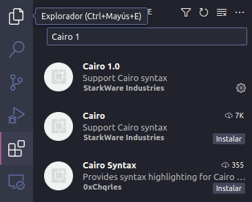

Esto facilita la corrección de errores y asegura que su código se ajuste a la versión específica del compilador.

Con la extensión `Cairo 1` configurada en su entorno de Visual Studio Code, estará listo para trabajar de manera eficiente con la sintaxis de Cairo y aprovechará las funciones de detección de errores y corrección automática proporcionadas por la extensión. Esto es especialmente útil para desarrollar aplicaciones en Cairo de manera más efectiva y sin problemas.

---

### Compilación del Contrato
Ahora procederemos a compilar nuestro [`Owner.cairo`](/Workshop/src/Owner.cairo). Si ha clonado este repositorio (recuerde que puede hacerlo con el comando `git clone ...`), le bastará con ejecutar un comando para llevar a cabo la compilación:

```bash
scarb build
```

Si todo ha ido bien, se debería crear una carpeta `dev/target` que contendrá el archivo `Workshop_Ownable.sierra.json`, así como otros contratos adicionales. Aunque nos centraremos en `Owner.cairo`, podría realizar la misma acción para el resto, estos archcvos en versión `sierra.json` los necesitaremospara llevar a cabo las operaciones de `Declare` y `Deploy` Si, por cualquier motivo, no se genera este archivo, puede intentar borrar la carpeta `target` y luego volver a ejecutar el comando `scarb build`.

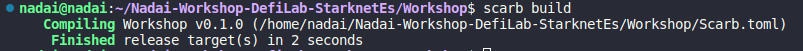

---

## Declare del Contrato con Starkli
Una vez tengamos todo preparado realizaremos la declaración del `Owner.cairo`, está declaración nos servirá para establecer una estrucutra que nos sirva para usar en el futuruo y si queremos volver a usar este contrato, solo usar su mismo `Class Hash` que nos ha dado, y pasar los argumetnos del construcutor que queremos, asi podrimaos tener un `Class hash` de un `ERC-20` standar o con ciertas propiedades, pero cada uno con su owner, nombre, simbolo, total supply o direrentes logicas que s proramaran.

Siempre es importante verificar que los `EXPORT` se hayan realizado correctamente para interactuar con la red de Starknet. 

```bash
export STARKNET_KEYSTORE=~/.starkli-wallets/deployer/Signer_Workshop.json
export STARKNET_ACCOUNT=~/.starkli-wallets/deployer/Account_Workshop.json
```

Si nos encontramos en la carptea raiz de nuestro proyecto tenemos dos opciones, o ir directamente a nuestra carpeta `dev` y ejecutar el `declare` con `starkli`:

```bash
starkli declare --watch Workshop_Ownable.sierra.json
```

O directamente indicando donde se encuentra nuestro archivo.

```bash
starkli declare --watch ./target/dev/Workshop_Ownable.sierra.json
```

Si recibe algun error revise si es por falta de encontrar el archivo, por lo que está indicando mal la ruta, nombre O al abrir una carpeta nueva se olvido de hacer los `export`, o puso su contraseña mal....El resultado que debería de obtener son los datos de Netowr utulizada, Versión del Compile, hash de la tranasación y la cmpilación a Sierra desde Casm la que nos generará un `Class hash` que deberemos guardar para ahora nuesto despliege

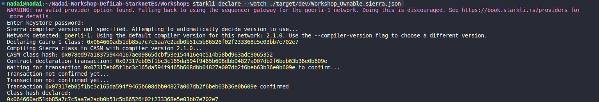

En este ejemplo usaremos `Class hash declared:0x064660ad51db85a7c7c5aa7e2adb0b51c5b86526f02f233368e5e03bb7e702e7`

---

### Despliegue del Contrato con Starkli
Ahora que hemos declarado nuestro contrato, si no se había hecho anteriormente y es único, podemos omitir la declaración y proceder directamente al despliegue. Para ello, debemos asegurarnos de revisar los argumentos que se pasan al constructor del contrato. En primer lugar, debemos proporcionar el `Class hash` del contrato que queremos desplegar, en este caso será `0x064660ad51db85a7c7c5aa7e2adb0b51c5b86526f02f233368e5e03bb7e702e7`. Además, en el constructor vemos que se requiere la dirección del contrato que actuará como el `owner`, así que en este caso añadiremos la dirección creada para la prueba y financiada para el taller, que es `0x009f47ebc2b3062b99e52f3b20b7bce93c6adc19911500cf569ac502fef90f6e`.

```rust
#[constructor]
fn constructor(ref self: ContractState, init_owner: ContractAddress) {
    self.owner.write(init_owner);
}
```

Por lo tanto, ejecutamos el siguiente comandosy añadimos el argumento requerido de la siguiente manera:


```bash
starkli deploy --watch 0x064660ad51db85a7c7c5aa7e2adb0b51c5b86526f02f233368e5e03bb7e702e7 0x009f47ebc2b3062b99e52f3b20b7bce93c6adc19911500cf569ac502fef90f6e
```

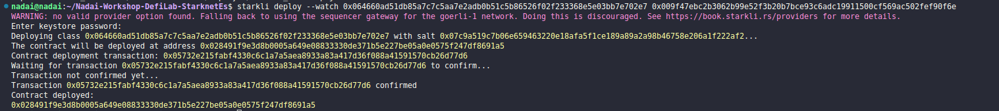

Puedes consultar el [enlace del contrato del "Owner"](https://testnet.starkscan.co/contract/0x028491f9e3d8b0005a649e08833330de371b5e227be05a0e0575f247df8691a5#read-write-contract) para asegurarte de que todo esté correcto. Además, con Starkli, puedes realizar llamadas directas al contrato para verificar que todo esté en orden.

---
## Comandos Starkli
### Class Hash
Puede conseguir el `class hash` para hacer el `declare` con el comando de starkli un a vez haya compilado su código de cairo, aquí algunos ejemplos

```bash
starkli class-hash ./target/dev/Workshop_Erc20.sierra.json
```

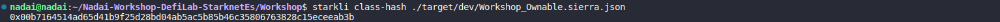

```bash
starkli class-hash ./target/dev/Workshop_ERC20.sierra.json
```

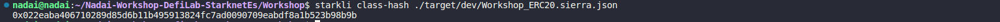

También podrá conseguir el `class hash` desde un contrato que ya haya sido desplegado pasandole como argumento la dirección del contrato

```bash
starkli class-hash-at 0x028491f9e3d8b0005a649e08833330de371b5e227be05a0e0575f247df8691a5
```
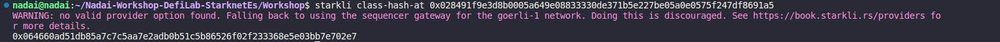

---

### Call
Desde Starkli, puedes cambiar el estado de un contrato, realizar operaciones o hacer consultas a datos y estados de la blockchain. Así que comprobemos si nuestro contrato de `Owner.cairo` tiene la dirección del contrato de la cuenta que hemos añadido. Para ello, debemos realizar una `call` e indicar qué función queremos invocar. Lo bueno de Starknet son los selectores, y en este caso, llamaremos a la función `get_owner` del contrato para obtener información sobre quién es el propietario, en este caso sólo es una `call` que no modifica el estado.

```bash
starkli call 0x028491f9e3d8b0005a649e08833330de371b5e227be05a0e0575f247df8691a5 get_owner
```

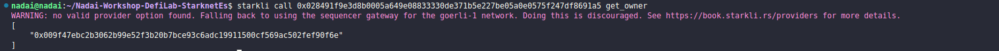

---
### Invoke
Desde Starkli, tienes la capacidad de llevar a cabo una invocación `invoke`. Esta característica te permite realizar operaciones que tienen el potencial de modificar el estado de un contrato en la blockchain. Para ejecutar un `invoke`, debes proporcionar ciertos parámetros clave, como la `dirección del contrato` que deseas modificar y la función específica que deseas ejecutar en ese contrato, en este ejemplo, `transfer_ownership`. Además, es necesario indicar los argumentos necesarios para la función que estás invocando, como la nueva dirección `0x027f68d0d0f474b1a25f359a42dc49a3003a3522d71765a5e7658e68520d7826`. Esta acción podría resultar en una transferencia de propiedad en el contrato, lo que modificaría su estado interno.

```bash
starkli invoke --watch 0x028491f9e3d8b0005a649e08833330de371b5e227be05a0e0575f247df8691a5 transfer_ownership 0x027f68d0d0f474b1a25f359a42dc49a3003a3522d71765a5e7658e68520d7826
```

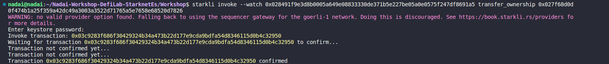

Si comparamos esto con una llamada `call` al `get_owner`, podemos verificar que la dirección resultante sería `0x027f68d0d0f474b1a25f359a42dc49a3003a3522d71765a5e7658e68520d7826`.

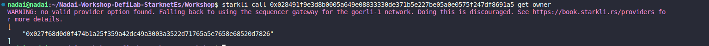

### Transaction
En Starkli, también puedes obtener detalles sobre una transacción proporcionando su `hash`. Puedes verificar información como el `tipo de transacción`, el `sender_address`, los datos de la `calldata` y otros datos importantes, incluido el `nonce` y la `signature`, mediante el siguiente comando:

```bash
starkli transaction 0x03c9283f686f30429324b34a473b22d177e9cda9bdfa54d8346115d0b4c32950
```

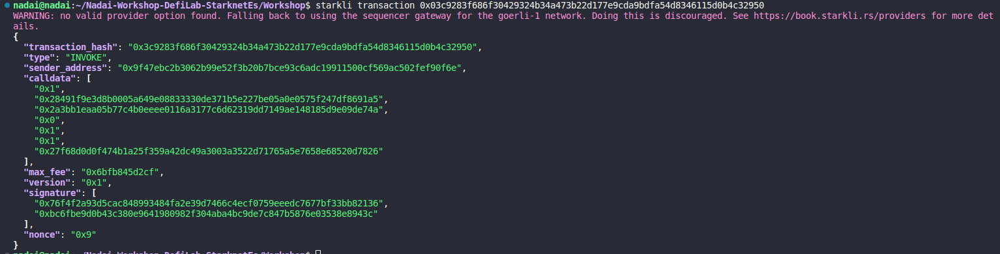

### Otros Comandos
Para conocer todos los comandos disponibles, puedes revisar la imagen que se encuentra debajo. Sin embargo, siéntete libre de mantenerte actualizado y explorar por ti mismo los comandos disponibles utilizando:

```bash
starkli --help
```

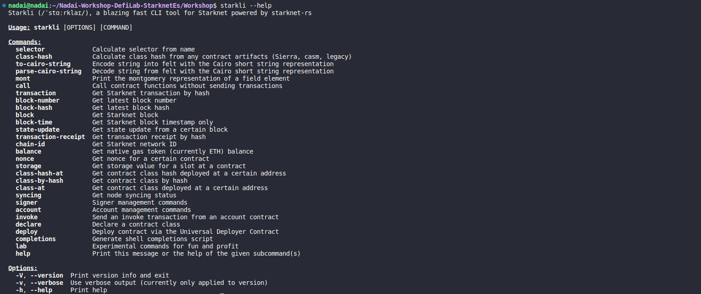

---

## Gestión de Dependencias Externas en Scarb
En Scarb, puedes añadir y gestionar las dependencias desde el archivo `Scarb.toml`. Añadir una dependencia es fácil y se puede hacer de varias maneras, una de ellas es utilizando el comando `scarb add`, que admite una variedad de parámetros para expresar tus dependencias. También puede mantener automáticamente la lista de dependencias ordenada, si no lo está. A continuación, se muestra un ejemplo de cómo agregar una dependencia, como alexandria_math:

```shell
scarb add alexandria_math --git https://github.com/keep-starknet-strange/alexandria.git --rev 27fbf5b
```

Para eliminar una dependencia, simplemente debes eliminar las líneas relacionadas en tu archivo Scarb.toml. Como atajo rápido, puedes utilizar el comando `scarb remove`, también conocido como `scarb rm`, que limpiará automáticamente el manifiesto de dependencias, debes indicar cual quieres eliminar como se muestra aquí:

```shell
scarb rm alexandria_math
```

Con estas herramientas, puedes gestionar tus dependencias de manera eficiente en Scarb y mantener tu proyecto organizado.

---

## STARK Easy
[STARK Easy](https://www.starkeasy.app/) es una dApp educativa diseñada tanto para desarrolladores como para usuarios, disponible exclusivamente en la red de testnet de Starknet. Esta plataforma ofrece una amplia variedad de recursos de aprendizaje, talleres, acceso a documentos oficiales y mucho más.

* **Stark Jitsu:** Aquí encontrarás una compilación de recursos de aprendizaje, talleres, documentos y espacios de estudio.
* **🚧 Stark Adobencha 🚧:** Una sección de entretenimiento educativo, donde podrás divertirte mientras aprendes acerca de diversos temas, tal como los abordados en Stark Jitsu.
* **Stark Dev-Station:** Esta sección ofrece una variedad de recursos tanto para usuarios como para desarrolladores. Explora aspectos relacionados con Cairo, despliega contratos y descubre el potencial de Starknet de primera mano.

Para obtener una descripción más detallada, consulta el [Readme en Github](https://github.com/Nadai2010/Nadai-StarkEasy/blob/main/Readme.es.md) si es necesario.

Ahora, te mostraremos los pasos para desplegar tu contrato de `Owner` con STARK Easy de manera sencilla:

---

<div align="center">

## Pasos para Desplegar tu Contrato con STARK Easy
### 1 - Ingresa a [STARK Easy](https://www.starkeasy.app/) y conecta tu billetera.

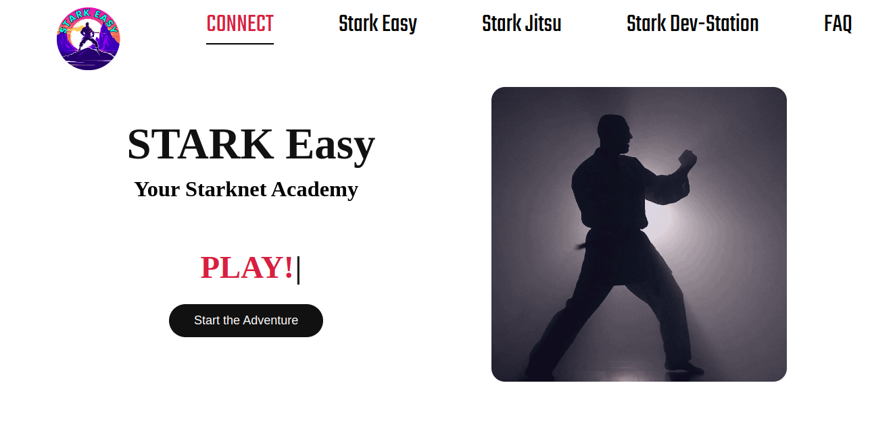


### 2 - Dirígete a la sección `Dev-Station` en la categoría `Standard`.

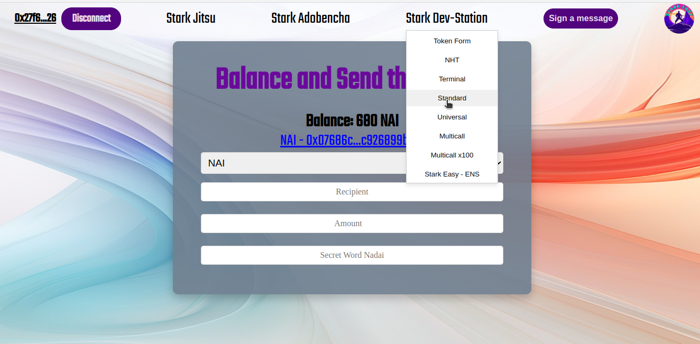


### 3 - Selecciona el contrato `Owner Contract` y revisa los argumentos necesarios, como la dirección del contrato (`ContractAddress`), que será la cuenta que actuará como `owner`. Copia el `class hash`, que necesitarás para desplegar tu contrato.

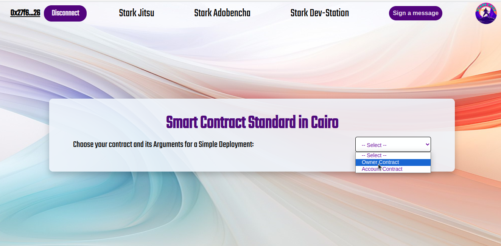
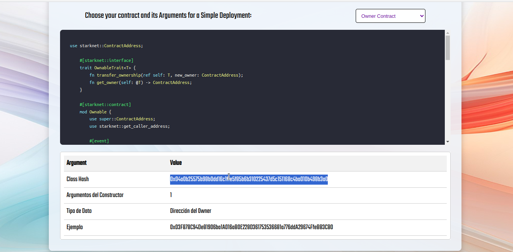

### 4 - Una vez que hayas copiado el `class hash`, ve a la sección `Dev-Station` y selecciona `Universal`. Aquí podrás desplegar tu contrato utilizando la declaración existente con la ayuda de `UDC` (Universal Deploy Contract) de Starknet. Completa los siguientes campos:
</div>

   - `classHash`: 0x04a0b25575b98b0dd16c1ffe5f85b6b310225437d5c151168c4ba010b498b3a0
   - `satl`: 1
   - `unique`: 1
   - `calldata_len`: 1
   - `calldata`: Dirección que actuará como "owner".

<div align="center">
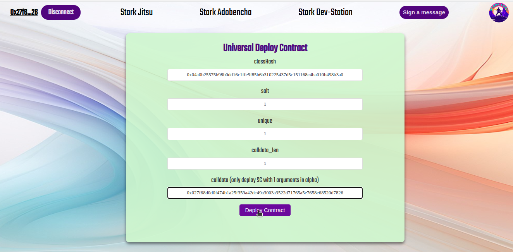

### 5 - Asegúrate de revisar que la transacción no genere errores y que los datos proporcionados sean correctos. Paga la tarifa (fee), y tu contrato será desplegado. Puedes verificar la actividad de tu billetera y explorar e interactuar con él a través de los exploradores. También puedes utilizar lo aprendido con `Starkli` para interactuar con el contrato.

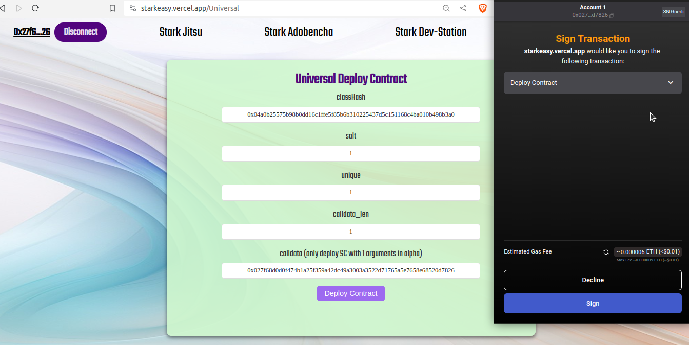

---

STARK Easy facilita el proceso de despliegue de contratos en la red de testnet y te brinda las herramientas necesarias para explorar y aprender más sobre el ecosistema de Starknet. **¡Disfruta de tu experiencia educativa y de desarrollo con STARK Easy!**

</div>