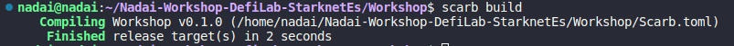
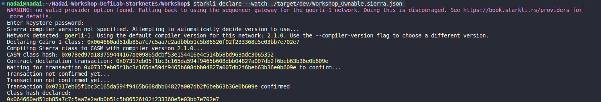

<div align="center">

  <h1 style="font-size: larger;">
    
    <strong> Workshop Starknet - Defilab & Escuela Crypto </strong> 
    
  </h1>

<a href="https://github.com/Starknet-Es">

<a href="https://github.com/Starknet-Es/jueves-de-cairo">

</a>
</a>
<a href="https://twitter.com/StarkNetEs">

</a>
<a href="https://twitter.com/DeFi_LaB">

</a>
<a href="https://twitter.com/Nadai02010">

</a>
<a href="https://github.com/Starknet-Es/StarknetEs-Aprendizaje">

</a>

</div>

## Recursos oficiales

- [Starknet Doc](https://docs.starknet.io/documentation/) - Documentos oficiales de Starknet
- [Starknet Book](https://book.starknet.io/) - Libro de Starknet
- [Cairo Doc](https://www.cairo-lang.org/docs/) - Documentos oficiales de de Cairo
- [Libro Cairo](https://cairo-book.github.io/) - Libro de Cairo
- [Sintaxis Cairo by Nethermind](https://github.com/NethermindEth/CairoByExample/)  |   [Sintaxis Cairo by LambdaClass](https://github.com/lambdaclass/cairo-by-example/)

---

## Temas

- [Instalación de Cairo](#configuración-de-su-entorno-de-desarrollo-de-starknet)
    - [Pre-requisitos](#pre-requisitos)


   

---


## Pre-requisitos
Antes de continuar, asegúrese de tener instalados los siguientes pre-requisitos en su sistema:

### Git
[Git:](https://git-scm.com/) Será necesario tener `Git` instalado. A continuación, se muestra el comando para instalar `Git` en Ubuntu. Recuerda verificar las versiones disponibles para tu sistema operativo en el enlace proporcionado:

```bash
apt-get install git
```

Si se produce un error y te solicita entrar como administrador, agrega `sudo` al principio del comando. Se abrirá una ventana para ingresar tu contraseña (que será invisible) y luego puedes presionar Enter para continuar.

```bash
sudo apt-get install git
```


## Guía Workshop StarknetEs  
Starkliup es el instalador del entorno Starkli, y se puede instalar fácilmente utilizando la línea de comando con curl:

```bash
curl https://get.starkli.sh | sh
```


Reinicie la terminal después de ejecutar el comando. Una vez que Starkliup se ha instalado correctamente, se puede usar para instalar Starkli

```bash
starkliup
```

Al ejecutar el comando, verá lo siguiente:


Reinicie el terminal y ejecute el siguiente comando para verificar la instalación:

```bash
starkli --version
```


Para actualizar a la última versión de Starkli, simplemente siga los pasos anteriores nuevamente.

## Scarb

Para usuarios de macOS y Linux, abra su terminal y ejecute el siguiente comando:

```bash
curl --proto '=https' --tlsv1.2 -sSf https://docs.swmansion.com/scarb/install.sh | sh
```


Reinicie el terminal y ejecute el siguiente comando para verificar la instalación:

```bash
scarb --version
```


Puede ejecutar el mismo comando para actualizarlo o directamnete añadir la versión manual de la versión que necesite de [aquí](https://github.com/software-mansion/scarb/releases)

```bash
curl --proto '=https' --tlsv1.2 -sSf https://docs.swmansion.com/scarb/install.sh | sh -s -- -v 0.6.0-alpha.4
```


Ejecute el siguiente comando para verificar su nueva versión, está vez la `2.1.0-rc4`:

```bash
scarb --version
```


Puede revisar ahora que tanto Scarb como Starkli están instaladas y preparadas para probar esta gran combinación de herramientas para Starknet y Cairo:

```bash
scarb --version 
starkli  --version 
```


## Cuenta

Una billetera inteligente se compone de dos partes: un firmante y un descriptor de cuenta. El firmante es un contrato inteligente que puede firmar transacciones ( necesitamos su clave privada ). El descriptor de cuenta es un archivo json que contiene información sobre la billetera inteligente, como su dirección y clave pública.

Primero, cree una billetera inteligente a través de las extensiones del navegador Braavos o Argent X. Siga sus instrucciones de billetera ( Argent o Braavos ). Después de crear y financiar su billetera inteligente con ETH ( use el Grifo Starknet Goerli siempre que lo necesite ), puede implementarlo en el testnet de Starknet para este tutorial.

## Crear un firmante
Un firmante es un contrato inteligente que puede firmar transacciones. Es un componente crucial de las cuentas en Starknet. Para crear un Signer solo necesitamos la clave privada de nuestra billetera inteligente (, la clave pública se puede derivar de ella ).

Starkli nos brinda la capacidad de crear un archivo "keystore" que almacena de forma segura la clave privada de nuestras billeteras inteligentes, cada una con una contraseña. Las cuentas en el archivo de almacén de claves se pueden usar para firmar transacciones usando Starkli. La principal ventaja de este enfoque es que evita almacenar la clave privada como texto sin formato en nuestra computadora. En cambio, utilizamos una contraseña para crear un archivo cifrado en la ubicación que elijamos.

Normalmente, el archivo de almacén de claves se almacena en la ubicación predeterminada de la CLI de Starkli. El siguiente comando crea un archivo de almacén de claves para nuestra billetera inteligente en la ubicación predeterminada en

```bash
mkdir -p ~/.starkli-wallets
```

y luego 


```bash
mkdir ~/.starkli-wallets/deployer
```

Ahora podremos crear nuestro nueva cuenta y firmante o directamente exportar una pk y añadir una directamnte, en este caso hemos copiado la pk de una cuenta de braavos y vamos a usarla, le hemos dado el nombre de `Nadai_Signer.json` a esta cuenta, l acual vamos añadir la private key de la ceunta de ArgentX ode Braavos, en este caso usamos Braavos.

 

```bash
starkli signer keystore from-key ~/.starkli-wallets/deployer/Nadai_Signer.json
```

Aqui el  texto por seguiridad no se visualizaará asi que pegue u pf luego revise si desea añadir un contraseña o no, y añadala, si todo ha ido bien le deberá aperecer su clave pública debajo del archivo encriptado que cabamos de crear


En el indicador de clave privada, pegue la clave privada de su billetera inteligente. En el mensaje de contraseña, ingrese una contraseña de su elección. Necesitará esta contraseña para firmar transacciones con Starkli.

Exporte la llave privada de su billetera Braavos o Argent. Para Argent X, puede encontrarlo en la sección "Configuración" → Seleccione su cuenta → "Exportar clave privada". Para Braavos, puede encontrarlo en la sección "Configuración" → "Privacidad y seguridad" → "Export Private Key".

Si bien es necesario conocer la clave privada de una billetera inteligente para firmar transacciones, no es suficiente. También debemos informar a Starkli sobre el mecanismo de firma empleado por nuestra billetera inteligente creada por Braavos o Argent X. ¿Usa una curva elíptica? En caso afirmativo, ¿cuál? Esta es la razón por la que necesitamos un archivo descriptor de cuenta.

## Crear un descriptor de cuenta
Starkli ofrece un comando para recopilar toda la información requerida de una billetera inteligente al proporcionar su dirección en cadena. Con estos datos, el CLI genera un archivo json que se puede usar para firmar transacciones.

```bash
touch ~/.starkli-wallets/deployer/Nadai_Account.json
```

El descripotr de la cuenta deberá de tener la siguiente estrucutra, que debermo s de ir rellenando:

```bash
{
  "version": 1,
  "variant": {
        "type": "open_zeppelin",
        "version": 1,
        "public_key": "<SMART_WALLET_PUBLIC_KEY>"
  },
    "deployment": {
        "status": "deployed",
        "class_hash": "<SMART_WALLET_CLASS_HASH>",
        "address": "<SMART_WALLET_ADDRESS>"
  }
}
```

La clave pública fue devuelta por el comando `starkli signer keystore from-key ~/.starkli-wallets/deployer/Nadai_Signer.json` Sin embargo, también puede encontrarlo usando el siguiente comando y escribiendo la contraseña que utilizó para crear el archivo keystore:

```bash
starkli signer keystore inspect ~/.starkli-wallets/deployer/Nadai_Signer.json
```


La dirección es la dirección de su billetera inteligente. Puede encontrarlo en las extensiones del navegador Braavos o Argent X. Luego use esta dirección para buscar el **class hash** de su billetera inteligente con el siguiente comando Starkli: 

```bash
starkli class-hash-at 0x027f68d0d0f474b1a25f359a42dc49a3003a3522d71765a5e7658e68520d7826
```


Aquí un ejemplo de como debería quedar con los datos completos:

```bash
{
  "version": 1,
  "variant": {
        "type": "open_zeppelin",
        "version": 1,
        "public_key": "0x062c8d0695de342484df87a02b9565d3d029c19e944177fa3ab6dd2dbc15e660"
  },
    "deployment": {
        "status": "deployed",
        "class_hash": "0x03131fa018d520a037686ce3efddeab8f28895662f019ca3ca18a626650f7d1e",
        "address": "0x027f68d0d0f474b1a25f359a42dc49a3003a3522d71765a5e7658e68520d7826"
  }
}
```

Quizás se pregunte por qué el tipo se define como `open_zeppelin` a pesar de que estamos trabajando con una billetera Braavos. Esto se debe a que la CLI utiliza el algoritmo predeterminado de Open Zeppelin para firmar transacciones, que es el mismo utilizado por Braavos y Argent X de forma predeterminada.

**Sin embargo, tenga en cuenta que una billetera inteligente Braavos con un firmante de hardware habilitado no funcionará en este contexto, ya que un firmante de hardware utiliza una curva elíptica diferente para firmar transacciones.**

## Configuración de variables de entorno
Para la mayoría de los indicadores de los diferentes comandos disponibles en Starkli, podemos definir variables de entorno para que los comandos sean más cortos y fáciles de administrar.

Hay dos variables de entorno primario que son vitales para el uso efectivo de la CLI de Starkli. Esta es la ubicación del archivo de la tienda de claves para el firmante y la ubicación del archivo del descriptor de cuenta.

```bash
export STARKNET_ACCOUNT=~/.starkli-wallets/deployer/Nadai_Account.json
export STARKNET_KEYSTORE=~/.starkli-wallets/deployer/Nadai_Signer.json
```


Con esto ya tendriamos lista nuestra Cuenta y Firmante para interactuar en Starknet a través de los comandos con Starkli,así que iremo sa preparar nuestro contrato para hacer el declare y el despliegue desde Scarb.

## Integrando Scarb en tu Flujo de Desarrollo 

Los siguientes pasos ilustran un flujo de trabajo típico para desarrollar un contrato Starknet utilizando Scarb, aunque si ha cloando este repositorio y quiere sólo seguir los procesos, pase directamente al paso 4.

1. Inicialización del Proyecto: Comienza ejecutando `scarb new` para crear un nuevo proyecto. Este comando generará automáticamente la estructura básica del proyecto, incluyendo un archivo de configuración `Scarb.toml` y un archivo inicial `src/lib.cairo`.

2. Desarrollo del Contrato: Escribe tu código Cairo y guárdalo en el directorio src, en este caso usaremos como base un contrato de Propiedad `Owner.cairo`

3. Gestión de Dependencias: Si tu contrato depende de bibliotecas externas, utiliza `scarb add` para incluir fácilmente estas dependencias en tu proyecto.

4. Compilación del Contrato: Ejecuta `scarb build` para compilar tu contrato en código Sierra. Este código resultante puede luego ser examinado con más detalle o utilizado como entrada para otras herramientas o procesos.

Al integrar Scarb en tu flujo de trabajo, aprovechas sus características para hacer tu proceso de desarrollo más eficiente y manejable.

### Inicialización del Proyecto: 
Primero crearemos nuestro nuevo paquete que generará el `Scarb.toml` y `src/lib.cairo` con el comando:

```bash
scarb new
```


En este paso aclaramos que para la gestión de los contratos se recomienda dejar el [`lib.cairo`](/Workshop/src/lib.cairo) para añadir por módulos y el contrato [`Owner.cairo`](/Workshop/src/Owner.cairo) o los que usemos por separado, auqnue también se puede usar el [`lib.cairo`](/Workshop/src/lib.cairo) con el código del contrato que queremos ejecutar si lo añadimos dentro, pero recomendamos para una mejor gestión la siguiente metódología.

### Desarrollo del Contrato:
Creamos un archivo en la carpeta `src` con el nombre del contrato que vamos a crear, en este caso [`Owner.cairo`](/Workshop/src/Owner.cairo) y pegamos el siguiente codigo:

```rust
use starknet::ContractAddress;

#[starknet::interface]
trait OwnableTrait<T> {
    fn transfer_ownership(ref self: T, new_owner: ContractAddress);
    fn get_owner(self: @T) -> ContractAddress;
}

#[starknet::contract]
mod Ownable {
    use super::ContractAddress;
    use starknet::get_caller_address;

    #[event]
    #[derive(Drop, starknet::Event)]
    enum Event {
      OwnershipTransferred1: OwnershipTransferred1,  
    }

    #[derive(Drop, starknet::Event)]
    struct OwnershipTransferred1 {
        #[key]
        prev_owner: ContractAddress,
        #[key]
        new_owner: ContractAddress,
    }

    #[storage]
    struct Storage {
        owner: ContractAddress,
    }

    #[constructor]
    fn constructor(ref self: ContractState, init_owner: ContractAddress) {
        self.owner.write(init_owner);
    }

    #[external(v0)]
    impl OwnableImpl of super::OwnableTrait<ContractState> {
        fn transfer_ownership(ref self: ContractState, new_owner: ContractAddress) {
            self.only_owner();
            let prev_owner = self.owner.read();
            self.owner.write(new_owner);
            self.emit(Event::OwnershipTransferred1(OwnershipTransferred1 {
                prev_owner: prev_owner,
                new_owner: new_owner,
            }));
        }

        fn get_owner(self: @ContractState) -> ContractAddress {
            self.owner.read()
        }
    }

    #[generate_trait]
    impl PrivateMethods of PrivateMethodsTrait {
        fn only_owner(self: @ContractState) {
            let caller = get_caller_address();
            assert(caller == self.owner.read(), 'Caller is not the owner');
        }
    }
}
```

Ahora vamos a nuestro [`lib.cairo`](/Workshop/src/lib.cairo) y borramos el ejemplo de fibonacci que viene incluido y añadimos la indicacion de los contratos en módulos que vamos a usar.

```bash
mod Owner;
```

### Gestión de Dependencias
Una vez copiado los pasos anteriores de este Workshop, deberemos guardar todos los cambios en nuestro editor de códido y proceder a modifcar nuestro [`Scarb.toml`](/Workshop/Scarb.toml) en el que le deberemos de añadri la versión del compilador que se va a ejecutar y darnos el código con su Representación Intermedia en Sierra, para que (no nos de el código en vérsión `casm` pura que sería una versión cruda de Cairo), da esta representación de Sierra del y hace que sea más leible y con propiedades de seguridad, este archivo se generraría en `.sierra` pero para hacer la declaración de nuestro contrato necesitaremos que nos genere un `.json`, en cual se generará con las indicaciones del `sierra = true`, asi que nuestro archivo [`Scarb.toml`](/Workshop/Scarb.toml) básico inicial para este ejemplo será:

```bash
[package]
name = "Workshop"
version = "0.1.0"

[dependencies]
starknet = ">=2.0.1"

[[target.starknet-contract]]
sierra = true
```

### Compilación del Contrato
Ahora procederemos a Compilar nuestro [`Owner.cairo`](/Workshop/src/Owner.cairo). Si ha clonado este repositorio recordamos `git clone ...`, le bastará con correr un comando para que se ejecute la compilación:

```bash
scarb build
```

Si todo ha ido bien, se le deberá de crear una carpeta `dev/target` con el archivo `Workshop_Ownable.sierra.json` que necesitaremos más adelante para hacer el `Declare` y el `Deploy`. Si por cualqueir motivo no l egenerá este archivo, purebe a borrar la carpeta `target` y volver a generar el `scarb build`




### Declare
Una vez tengamos todo preparado realizaremos la declaración del `Owner.cairo`, está declaración nos servirá para establecer una estrucutra que nos sirva para usar en el futuruo y si queremos vilver a usar este contrato, solo usar su mismo `Class Hash` que nos ha dado, y pasar los argumetnos del construcutor que queremos, asi podrimaos tener un `Class hash` de un `ERC-20` standar o con ciertas propiedades, pero cada uno con su owner, nombre, simbolo, total supply o direrentes logicas que s proramaran.

Si nos encontramos en la carptea raiz de nuestro proyecto tenemos dos opciones, o ir directamente a nuestra carpeta `dev` y ejecutar el `declare` con `starkli`:

```bash
starkli declare --watch Workshop_Ownable.sierra.json
```

O directamente indicando donde se encuentra nuestro archivo.

```bash
starkli declare --watch ./target/dev/Workshop_Ownable.sierra.json
```

Si recibe algun error revise si es por falta de encontrar el archivo, por lo que está indicando mal la ruta, nombre O al abrir una carpeta nueva se olvido de hacer los `export`, o puso su contraseña mal....El resultado que debería de obtener son los datos de Netowr utulizada, Versión del Compile, hash de la tranasación y la cmpilación a Sierra desde Casm la que nos generará un `Class hash` que deberemos guardar para ahora nuesto despliege



En este ejemplo usaremos `Class hash declared:0x064660ad51db85a7c7c5aa7e2adb0b51c5b86526f02f233368e5e03bb7e702e7`


## Comandos Starkli

starkli class-hash Hola.json


starkli declare --watch Hola.json


starkli deploy --watch 0x0274ef190c2dc9c9660e5357e8318e33e7b9240fb1c6e4086d0a540b41beeea8


starkli invoke --watch 0x04f00ae43a70c9978c4688621daf599c8b5d102b63d075298b5ce033dc4bff8d Hola_Starknianos_Dice 1921882746024867290215520585294889529299439584169484315753


starkli selector Hola_Starknianos_Dice


starkli call 0x018561e9475a9248f0580e3274fb8a027b33850dbd2e53f2d6acb9c14fcd0599 tokenURI \view_with_args\1

starkli transaction 0x0252691273c3ee45f90f2aabc826a048c8ab3513c3e99e9cb54afff1de768ad7

### comando favorito

starkli class-hash-at 0x04f00ae43a70c9978c4688621daf599c8b5d102b63d075298b5ce033dc4bff8d


## STARKLI V2 OWNER

starkli class-hash Nadai_Ownable.sierra.json

0x04a0b25575b98b0dd16c1ffe5f85b6b310225437d5c151168c4ba010b498b3a0

starkli declare --watch Nadai_Ownable.sierra.json


starkli deploy --watch 0x04a0b25575b98b0dd16c1ffe5f85b6b310225437d5c151168c4ba010b498b3a0 0x02473316ad605a95287cba2972ec66ab40e2faf0a0f37fba9fbcee29b0f1612d


starkli call 0x03b6e03f0cb4c6d69de89b3e600893bbb0b143ea689e9fed648f53ea26d68010 get_owner


starkli invoke --watch 0x03b6e03f0cb4c6d69de89b3e600893bbb0b143ea689e9fed648f53ea26d68010 transfer_ownership 0x03F878C94De81906ba1A016aB0E228D361753536681a776ddA29674FfeBB3CB0


https://goerli.voyager.online/contract/0x03b6e03f0cb4c6d69de89b3e600893bbb0b143ea689e9fed648f53ea26d68010#readContract


starkli invoke --watch 0x049d36570d4e46f48e99674bd3fcc84644ddd6b96f7c741b1562b82f9e004dc7 approve 0x03F878C94De81906ba1A016aB0E228D361753536681a776ddA29674FfeBB3CB0 10000 0


starkli invoke --watch 0x049d36570d4e46f48e99674bd3fcc84644ddd6b96f7c741b1562b82f9e004dc7 transfer 0x03F878C94De81906ba1A016aB0E228D361753536681a776ddA29674FfeBB3CB0 100000000000000 0


starkli call 0x049d36570d4e46f48e99674bd3fcc84644ddd6b96f7c741b1562b82f9e004dc7 balanceOf 0x2473316ad605a95287cba2972ec66ab40e2faf0a0f37fba9fbcee29b0f1612d 


0x00000000000000000000000000000000000000000000000000064814f6637cf9 = 1768104730524921 0 = 0.001768 ETH

starkli parse-cairo-string 0x00000000000000000000000000000000000000000000000000737461726b6c69

starkli selector getPublicKey


starkli invoke --watch 0x07686ccbe3e33aefec722bd7211e42e47269f16a2a918318bdb27a99c926899b mint 1 0

starkli deploy --watch 0x026993fbbca1fc804df732e9aeaf421939c7c994c901e11b99256c6e48a7115f 0x62c8d0695de342484df87a02b9565d3d029c19e944177fa3ab6dd2dbc15e660

0x6837fcdea25fa6e8c9ca48eb357f793b751924ae48cdc353e2afab88e7338e2
0x2e4b8750057c4cff92b18b53cfb6c24b9f2202959a6dbb4b9afb2dcf054624c